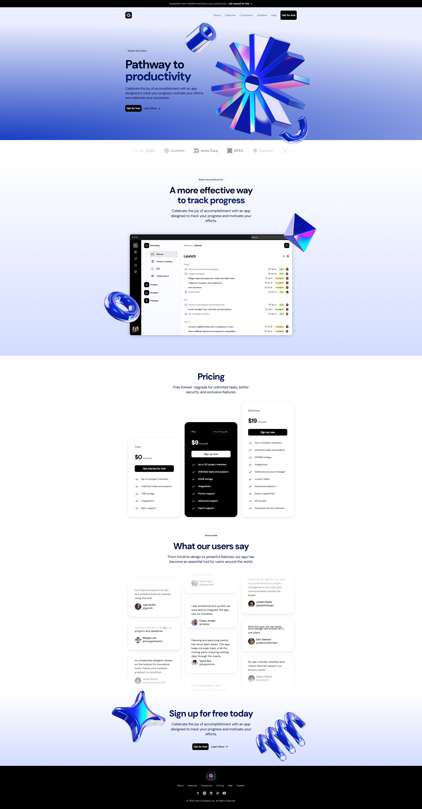

# 🚀 Light SaaS Landing Page

A stunning and responsive SaaS landing page built with **Next.js**, **React**, **TailwindCSS**, and **Framer Motion**. This project demonstrates how to turn a Figma design into a beautiful and functional website, complete with smooth animations and modern UI/UX best practices.

> ✅ Perfect for showcasing your frontend skills to potential clients or employers.

---

## 🖥️ Tech Stack

- **React** – Declarative, component-based UI
- **Next.js** – Optimized framework for server-side rendering and SEO
- **TailwindCSS** – Utility-first CSS for rapid styling
- **Framer Motion** – Animation library for silky-smooth transitions and effects

---

## 📸 Preview



**Live demo**: [light-saas-landing-page-lake.vercel.app](https://light-saas-landing-page-lake.vercel.app/)

---

## 🔧 Features

- ⚡ Lightning-fast performance with Next.js
- 🌈 Fully responsive and mobile-friendly
- 💅 Clean and minimal UI with TailwindCSS
- 🎞️ Animations and transitions powered by Framer Motion
- 🎨 Figma to code: real-world design implementation
- 🔍 SEO-ready and optimized for performance

---

## 📂 Folder Structure

light-saas-landing-page/
├── components/        # Reusable UI components
├── pages/             # Next.js pages
│   └── index.tsx      # Landing page entry point
├── public/            # Static assets
├── styles/            # Global styles
├── utils/             
├── .gitignore
├── tailwind.config.js
├── tsconfig.json
└── README.md

---

## 🛠️ Getting Started

### 1. Clone the Repo

```bash
git clone https://github.com/mcace007/light-saas-landing-page.git
cd light-saas-landing-page
```

### 2. Install Dependencies

```bash
npm install
```

### 3. Run the Development Server

```bash
npm run dev
```

Navigate to `http://localhost:3000` to view the project.

---

## 📦 Build for Production

```bash
npm run build
npm start
```

---

## 🧪 Testing

This project doesn't include testing by default, but you can integrate **Jest** or **React Testing Library** easily for unit and component testing.

---
